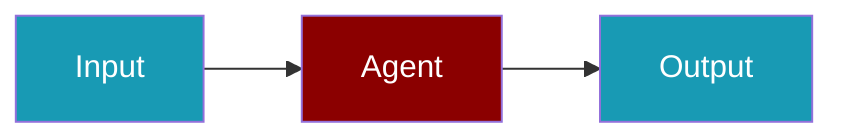

# Laminar CLI Commands

## Environment Setup

```bash
export LMNR_PROJECT_API_KEY=...
```

## Commands

```bash
praisonai-ts observability doctor laminar
praisonai-ts observability doctor laminar --json
praisonai-ts observability test laminar
```

## Related

<CardGroup cols={2}>
  <Card title="Laminar Code Usage" icon="book" href="/docs/js/observability/laminar-code">
    Laminar Code Usage
  </Card>
</CardGroup>
