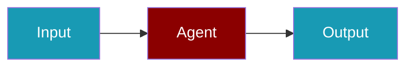

# Langfuse CLI Commands

## Environment Setup

```bash
export LANGFUSE_SECRET_KEY=sk-lf-...
export LANGFUSE_PUBLIC_KEY=pk-lf-...
```

## Commands

### Check Status

```bash
praisonai-ts observability doctor langfuse
```

### JSON Output

```bash
praisonai-ts observability doctor langfuse --json
```

### Test Connection

```bash
praisonai-ts observability test langfuse
```

## Related

<CardGroup cols={2}>
  <Card title="Langfuse Code Usage" icon="book" href="/docs/js/observability/langfuse-code">
    Langfuse Code Usage
  </Card>
</CardGroup>
