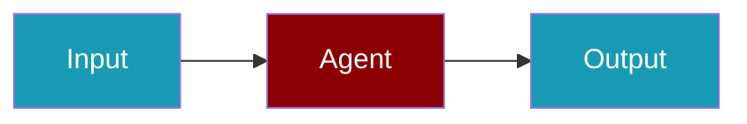

# LangSmith CLI Commands

## Environment Setup

```bash
export LANGSMITH_API_KEY=ls-...        # or legacy LANGCHAIN_API_KEY
export LANGSMITH_PROJECT=my-project    # optional
export LANGSMITH_ENDPOINT=...          # optional, http(s) only
```

## Commands

```bash
praisonai-ts observability doctor langsmith
praisonai-ts observability doctor langsmith --json
praisonai-ts observability test langsmith
```

With `LANGSMITH_API_KEY` set, `observability doctor langsmith` and `observability test langsmith` now report `delivers: true` and a successful delivered trace (previously they reported "no delivery").

## Related

<CardGroup cols={2}>
  <Card title="LangSmith Code Usage" icon="book" href="/js/observability/langsmith-code">
    LangSmith Code Usage
  </Card>
</CardGroup>
