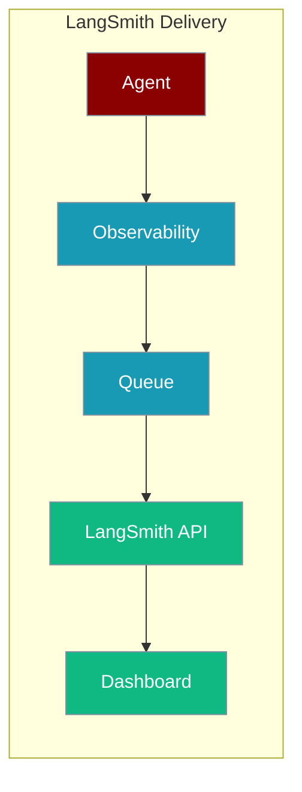
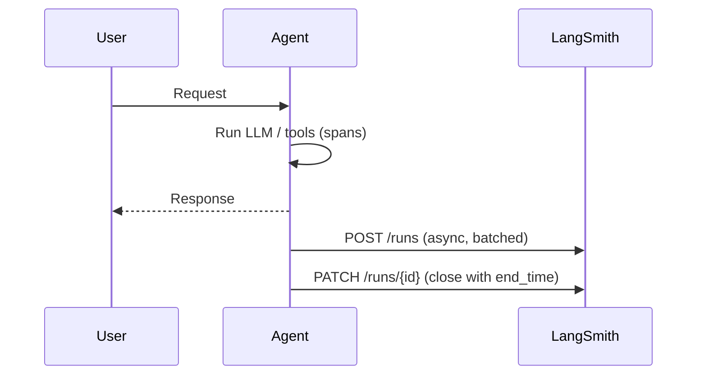

LangSmith stores every trace from your agents so you can replay, debug, and share runs — PraisonAI delivers them live over LangSmith's Runs API.



## Quick Start

<Steps>
<Step title="Simple Usage">

```typescript
import { Agent, createObservabilityAdapter, setObservabilityAdapter } from 'praisonai';

const obs = await createObservabilityAdapter('langsmith');
setObservabilityAdapter(obs);

const agent = new Agent({
  name: 'TracedAgent',
  instructions: 'You are helpful.',
  observability: true
});

await agent.chat('Hello!');
await obs.flush();
```

</Step>

<Step title="With Configuration">

```typescript
import { Agent, createObservabilityAdapter, setObservabilityAdapter } from 'praisonai';

const obs = await createObservabilityAdapter('langsmith', {
  name: 'langsmith',
  apiKey: process.env.LANGSMITH_API_KEY,
  baseUrl: process.env.LANGSMITH_ENDPOINT,   // e.g. https://langsmith.my-company.com
  projectId: 'production-agents'
});
setObservabilityAdapter(obs);
```

</Step>
</Steps>

---

## How It Works

Spans are posted to LangSmith as runs, asynchronously, while your agent keeps working.



| PraisonAI concept | LangSmith concept |
|---|---|
| Agent trace | Root run (`run_type: chain`) |
| Tool span | Child run (`run_type: tool`) |
| LLM span | Child run (`run_type: llm`) |
| Retrieval span | Child run (`run_type: retriever`) |
| Span event | Entry in run's `extra.events[]` |

---

## Configuration Options

Secrets are read from the environment only and never logged; programmatic values override the env.

| Option | Env variable (alt) | Default | Description |
|---|---|---|---|
| API key | `LANGSMITH_API_KEY` (`LANGCHAIN_API_KEY`) | — | Required for delivery; sent as `x-api-key`. |
| Endpoint | `LANGSMITH_ENDPOINT` (`LANGCHAIN_ENDPOINT`) | `https://api.smith.langchain.com` | Must be `http(s)`. Plaintext `http://` is only accepted for loopback hosts. |
| Project | `LANGSMITH_PROJECT` (`LANGCHAIN_PROJECT`) | *(none)* | Shows up as the LangSmith session name. |

<Note>
When self-hosting over `http://`, use `localhost`, `127.0.0.1`, or `::1` — the adapter refuses non-loopback plaintext endpoints so the API key cannot leak on the wire.
</Note>

---

## When does delivery happen?

Spans are posted asynchronously; your agent's hot path never waits for LangSmith. Call `await obs.flush()` before the process exits (e.g. in a serverless handler) to drain the queue. If a request fails, `flush()` warns how many runs did not reach LangSmith — the key, endpoint and network are not silently swallowed.

---

## Common Patterns

Multiple agents sharing one trace keep their tree in LangSmith via `parent_run_id`.

```typescript
import { Agent, Agents, createObservabilityAdapter, setObservabilityAdapter } from 'praisonai';

const obs = await createObservabilityAdapter('langsmith');
setObservabilityAdapter(obs);

const researcher = new Agent({
  name: 'Researcher',
  instructions: 'Research topics thoroughly.',
  observability: true
});

const writer = new Agent({
  name: 'Writer',
  instructions: 'Write clear summaries.',
  observability: true
});

const agents = new Agents({ agents: [researcher, writer] });
await agents.start('Summarize AI trends 2024');
await obs.flush();
```

Self-hosted LangSmith is one env var away.

```typescript
import { Agent, createObservabilityAdapter, setObservabilityAdapter } from 'praisonai';

process.env.LANGSMITH_ENDPOINT = 'https://langsmith.my-company.com';

const obs = await createObservabilityAdapter('langsmith');
setObservabilityAdapter(obs);

const agent = new Agent({
  name: 'InternalAgent',
  instructions: 'You are helpful.',
  observability: true
});

await agent.chat('Hello!');
await obs.flush();
```

Missing key degrades gracefully: spans record to memory and `flush()` warns nothing was delivered.

```typescript
import { createObservabilityAdapter } from 'praisonai';

const obs = await createObservabilityAdapter('langsmith');
console.log(obs.isEnabled);
// false when LANGSMITH_API_KEY is unset — traces stay in memory; safe for local dev.
```

---

## Best Practices

<AccordionGroup>
<Accordion title="Set LANGSMITH_API_KEY once per process">
Prefer the environment variable over the programmatic `apiKey` so the key stays out of source control. The env key is read on `initialize()`.
</Accordion>

<Accordion title="Always await obs.flush() before exiting">
Delivery is async. In short-lived processes (scripts, serverless handlers) call `await obs.flush()` so queued runs reach LangSmith before the process ends.
</Accordion>

<Accordion title="Keep LANGSMITH_ENDPOINT on https://">
The API key travels as `x-api-key`. Plaintext `http://` is refused for non-loopback hosts; use `https://` unless the endpoint is `localhost`.
</Accordion>

<Accordion title="Use LANGSMITH_PROJECT per environment">
Set a different `LANGSMITH_PROJECT` for dev, staging, and prod so traces land in separate LangSmith sessions.
</Accordion>
</AccordionGroup>

---

## Related

<CardGroup cols={2}>
  <Card title="LangSmith CLI" icon="terminal" href="/js/observability/langsmith-cli">
    CLI commands
  </Card>
  <Card title="Observability" icon="eye" href="/js/observability">
    Overview and delivery matrix
  </Card>
</CardGroup>
