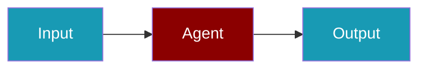

# LangWatch CLI Commands

## Environment Setup

```bash
export LANGWATCH_API_KEY=...
```

## Commands

```bash
praisonai-ts observability doctor langwatch
praisonai-ts observability doctor langwatch --json
praisonai-ts observability test langwatch
```

## Related

<CardGroup cols={2}>
  <Card title="LangWatch Code Usage" icon="book" href="/docs/js/observability/langwatch-code">
    LangWatch Code Usage
  </Card>
</CardGroup>
