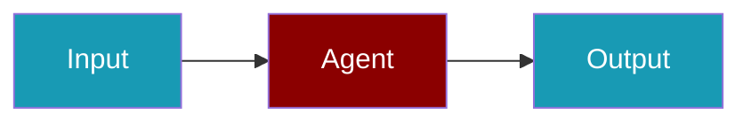

# Maxim CLI Commands

## Environment Setup

```bash
export MAXIM_API_KEY=...
```

## Commands

```bash
praisonai-ts observability doctor maxim
praisonai-ts observability doctor maxim --json
praisonai-ts observability test maxim
```

## Related

<CardGroup cols={2}>
  <Card title="Maxim Code Usage" icon="book" href="/docs/js/observability/maxim-code">
    Maxim Code Usage
  </Card>
</CardGroup>
