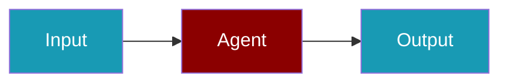

# Patronus CLI Commands

## Environment Setup

```bash
export PATRONUS_API_KEY=...
```

## Commands

```bash
praisonai-ts observability doctor patronus
praisonai-ts observability doctor patronus --json
praisonai-ts observability test patronus
```

## Related

<CardGroup cols={2}>
  <Card title="Patronus Code Usage" icon="book" href="/docs/js/observability/patronus-code">
    Patronus Code Usage
  </Card>
</CardGroup>
