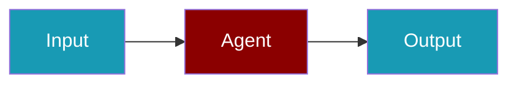

# Scorecard CLI Commands

## Environment Setup

```bash
export SCORECARD_API_KEY=...
```

## Commands

```bash
praisonai-ts observability doctor scorecard
praisonai-ts observability doctor scorecard --json
praisonai-ts observability test scorecard
```

## Related

<CardGroup cols={2}>
  <Card title="Scorecard Code Usage" icon="book" href="/docs/js/observability/scorecard-code">
    Scorecard Code Usage
  </Card>
</CardGroup>
