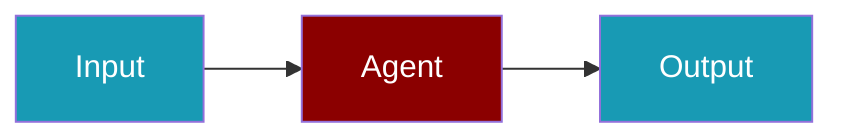

# Scorecard Observability

## Environment Variables

```bash
export SCORECARD_API_KEY=...
```

## Quick Start

<Steps>
<Step title="Simple Usage">
```typescript
import { Agent, setObservabilityAdapter } from 'praisonai';
import { createObservabilityAdapter } from 'praisonai/observability';

const obs = await createObservabilityAdapter('scorecard');
setObservabilityAdapter(obs);

const agent = new Agent({
  name: 'TracedAgent',
  instructions: 'You are helpful.',
  llm: 'openai/gpt-4o-mini'
});

await agent.chat('Hello!');
await obs.flush();
```
</Step>
<Step title="With Configuration">
Adjust observability adapter options and agent settings for production — see the sections above.
</Step>
</Steps>

## Related

<CardGroup cols={2}>
  <Card title="Scorecard CLI Usage" icon="terminal" href="/docs/js/observability/scorecard-cli">
    Scorecard CLI Usage
  </Card>
</CardGroup>
