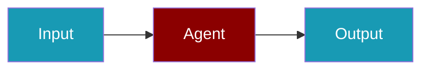

# SigNoz CLI Commands

## Environment Setup

```bash
export SIGNOZ_ACCESS_TOKEN=...
```

## Commands

```bash
praisonai-ts observability doctor signoz
praisonai-ts observability doctor signoz --json
praisonai-ts observability test signoz
```

## Related

<CardGroup cols={2}>
  <Card title="SigNoz Code Usage" icon="book" href="/docs/js/observability/signoz-code">
    SigNoz Code Usage
  </Card>
</CardGroup>
