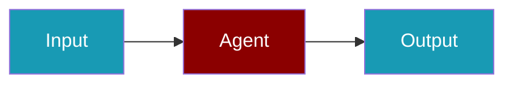

# Traceloop CLI Commands

## Environment Setup

```bash
export TRACELOOP_API_KEY=...
```

## Commands

```bash
praisonai-ts observability doctor traceloop
praisonai-ts observability doctor traceloop --json
praisonai-ts observability test traceloop
```

## Related

<CardGroup cols={2}>
  <Card title="Traceloop Code Usage" icon="book" href="/docs/js/observability/traceloop-code">
    Traceloop Code Usage
  </Card>
</CardGroup>
