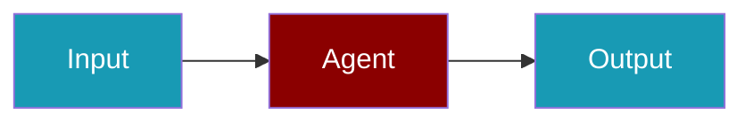

# Weave CLI Commands

## Environment Setup

```bash
export WANDB_API_KEY=...
```

## Commands

```bash
praisonai-ts observability doctor weave
praisonai-ts observability doctor weave --json
praisonai-ts observability test weave
```

## Related

<CardGroup cols={2}>
  <Card title="Weave Code Usage" icon="book" href="/docs/js/observability/weave-code">
    Weave Code Usage
  </Card>
</CardGroup>
