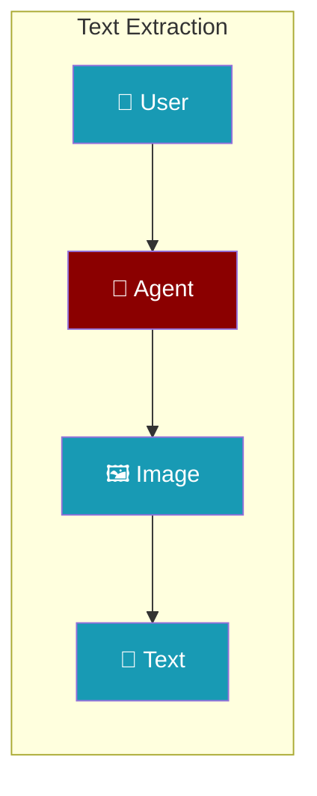
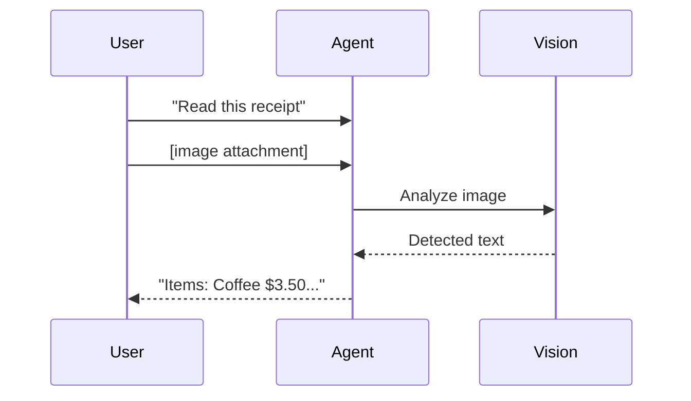
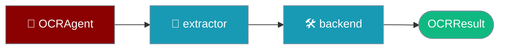

Agents can read text from images - receipts, documents, signs, and screenshots.


```mermaid
graph LR
    subgraph "Text Extraction"
        A[👤 User] --> B[🤖 Agent]
        B --> C[🖼️ Image]
        C --> D[📝 Text]
    end

    classDef agent fill:#8B0000,color:#fff
    classDef tool fill:#189AB4,color:#fff

    class B agent
    class A,C,D tool
```

## Quick Start

<Steps>

<Step title="Simple Usage">
```typescript
import { Agent } from 'praisonai';

const agent = new Agent({
  instructions: 'Extract all text from images',
  llm: 'gpt-4o'  // Vision-capable model
});

await agent.chat([
  { role: 'user', content: [
    { type: 'text', text: 'What text is on this receipt?' },
    { type: 'image', url: 'https://example.com/receipt.jpg' }
  ]}
]);
// "Store: Coffee Shop, Total: $4.50..."
```
</Step>

<Step title="With Configuration">
```typescript
const agent = new Agent({
  instructions: 'Extract data as JSON',
  outputFormat: 'json'
});

await agent.chat([
  { role: 'user', content: [
    { type: 'text', text: 'Extract items and prices from this receipt' },
    { type: 'image', path: './receipt.jpg' }
  ]}
]);
// { items: [...], total: 4.50, date: '...' }
```
</Step>

</Steps>

---

## User Interaction Flow


```mermaid
sequenceDiagram
    participant User
    participant Agent
    participant Vision
    
    User->>Agent: "Read this receipt"
    User->>Agent: [image attachment]
    Agent->>Vision: Analyze image
    Vision-->>Agent: Detected text
    Agent-->>User: "Items: Coffee $3.50..."
```

---

## Configuration Levels

```typescript
// Level 1: Bool - Enable with vision model
const agent = new Agent({
  llm: 'gpt-4o',
  vision: true
});

// Level 2: String - High detail for small text
const agent = new Agent({
  llm: 'gpt-4o',
  vision: 'high'
});

// Level 3: Dict - Full options
const agent = new Agent({
  vision: {
    detail: 'high',
    ocr: true,
    language: 'en'
  }
});
```

---

## Common Uses

| Use Case | Example |
|----------|---------|
| Receipts | Extract items, totals, dates |
| Business cards | Get contact information |
| Documents | Digitize scanned papers |
| Screenshots | Read displayed text |

---

## Dedicated `OCRAgent` class

`OCRAgent` calls a real OCR backend through a required `extractor` function.


```mermaid
graph LR
    A[🤖 OCRAgent] --> B[🔌 extractor]
    B --> C[🛠️ backend]
    C --> D([OCRResult])

    classDef agent fill:#8B0000,stroke:#7C90A0,color:#fff
    classDef step fill:#189AB4,stroke:#7C90A0,color:#fff
    classDef result fill:#10B981,stroke:#7C90A0,color:#fff

    class A agent
    class B,C step
    class D result
```

```typescript
import { OCRAgent, type OCRExtractor } from 'praisonai';

const mistralExtractor: OCRExtractor = async ({ source, document, model, options, apiKey, baseUrl }) => {
  // Call your OCR backend (Mistral OCR, Tesseract, Cloud Vision, ...)
  // Return { text, pages: [{ index, markdown }], images?, metadata? }
  return { text: '...', pages: [{ index: 0, markdown: '...' }] };
};

const agent = new OCRAgent({
  name: 'Reader',
  extractor: mistralExtractor,
  model: 'mistral/mistral-ocr-latest',
});

const result = await agent.extract('receipt.jpg');
const textOnly = await agent.read('receipt.jpg');
```

### OCRAgentConfig

| Field | Type | Default | Description |
|-------|------|---------|-------------|
| `extractor` | `OCRExtractor` | — | OCR backend. **Required at call time** — `extract()` throws without it. |
| `name` | `string` | `'OCRAgent'` | Agent name |
| `instructions` | `string` | — | Optional instructions |
| `llm` / `model` | `string` | `'mistral/mistral-ocr-latest'` | OCR model (`model` is an alias for `llm`) |
| `baseUrl` | `string` | — | Custom API endpoint URL |
| `apiKey` | `string` | — | API key for the provider |
| `ocr` | `boolean \| OCRConfig` | — | OCR settings; `true`/`false` use defaults |
| `verbose` | `boolean \| number` | `true` | Log progress messages |

### OCRConfig

| Field | Type | Default | Description |
|-------|------|---------|-------------|
| `pages` | `number[]` | `[]` | Specific pages to extract (for PDFs) |
| `imageLimit` | `number` | `0` | Maximum images per page |
| `timeout` | `number` | `600` | Timeout in seconds |
| `apiBase` | `string` | `''` | Custom API endpoint URL |
| `apiKey` | `string` | `''` | API key for the provider |

### OCRExtractRequest

The extractor receives this request:

| Field | Type | Description |
|-------|------|-------------|
| `source` | `string` | URL or path the caller asked to read |
| `document` | `{ type: string; ... }` | Provider document reference derived from `source` |
| `model` | `string` | Model to use for this extraction |
| `options` | `Required<OCRConfig>` | Resolved OCR options |
| `baseUrl` | `string` | Custom API endpoint URL, if configured |
| `apiKey` | `string` | API key, if configured |

### OCRResult

The extractor returns this shape:

| Field | Type | Description |
|-------|------|-------------|
| `text` | `string` | Combined extracted text |
| `pages` | `OCRPage[]` | Per-page results (`index`, `markdown`, `images?`) |
| `images` | `string[]` | Optional base64 images |
| `metadata` | `Record<string, any>` | Optional additional metadata |

<Warning>
`OCRAgent.extract()` (and `.read()`) now **throw** when no `extractor` is configured. Before, they returned placeholder text like `"[OCR extraction from … - requires API integration]"` while logging `✓ OCR complete`. That fabricated path is gone.
</Warning>

---

## API Reference

<Card title="OCRConfig" icon="code" href="/sdk/reference/typescript/classes/OCRConfig">
  Complete configuration options
</Card>
<Card title="OCRAgent" icon="robot" href="/sdk/reference/typescript/classes/OCRAgent">
  Full class documentation
</Card>

---

## Best Practices

<AccordionGroup>
  <Accordion title="Use high detail for small text">
    Set `detail: 'high'` when reading receipts or documents.
  </Accordion>
  
  <Accordion title="Be specific about what to extract">
    "Extract the total and date" works better than "read this".
  </Accordion>
  
  <Accordion title="Use good quality images">
    Clear, well-lit images produce better results.
  </Accordion>
</AccordionGroup>

---

## Related

<CardGroup cols={2}>
  <Card title="Vision" icon="eye" href="/js/vision">
    Image analysis
  </Card>
  <Card title="Files" icon="file" href="/js/files">
    File operations
  </Card>
</CardGroup>
