OCR (Optical Character Recognition) extracts text from images, scanned documents, and photos.

```mermaid
graph LR
    subgraph "Text Extraction"
        A[🖼️ Image] --> B[🔍 OCR]
        B --> C[📝 Text]
    end
    
    classDef image fill:#6366F1,stroke:#7C90A0,color:#fff
    classDef ocr fill:#F59E0B,stroke:#7C90A0,color:#fff
    classDef text fill:#10B981,stroke:#7C90A0,color:#fff
    
    class A image
    class B ocr
    class C text
```



## Quick Start

```typescript
import { Agent } from 'praisonai';

const agent = new Agent({
  llm: 'gpt-4o',
  instructions: 'You extract and process text from images'
});

// Extract text from a receipt
const text = await agent.chat([
  { role: 'user', content: [
    { type: 'text', text: 'Extract all text from this receipt' },
    { type: 'image', image: 'https://example.com/receipt.jpg' }
  ]}
]);
```

## Common Uses

| Use Case | Example |
|----------|---------|
| Receipts | Extract items and totals |
| Business cards | Get contact information |
| Documents | Digitize scanned papers |
| Signs | Read text from photos |
| Screenshots | Extract displayed text |

---

## Best Practices

<AccordionGroup>
  <Accordion title="Use clear images">
    Higher resolution and good lighting produce better OCR results.
  </Accordion>
  
  <Accordion title="Specify what to extract">
    Tell the agent exactly what information you need from the image.
  </Accordion>
</AccordionGroup>

---

## Related

<CardGroup cols={2}>
  <Card title="Vision" icon="eye" href="/docs/js/vision">
    Image analysis
  </Card>
  <Card title="Files" icon="file" href="/docs/js/files">
    File operations
  </Card>
</CardGroup>
