Agents can read text from images - receipts, documents, signs, and screenshots.

```mermaid
graph LR
    subgraph "Text Extraction"
        A[👤 User] --> B[🤖 Agent]
        B --> C[🖼️ Image]
        C --> D[📝 Text]
    end
    
    classDef user fill:#6366F1,stroke:#7C90A0,color:#fff
    classDef agent fill:#F59E0B,stroke:#7C90A0,color:#fff
    classDef output fill:#10B981,stroke:#7C90A0,color:#fff
    
    class A user
    class B agent
    class C,D output
```



## Quick Start

<Steps>

<Step title="Extract Text from Image">
```typescript
import { Agent } from 'praisonai';

const agent = new Agent({
  instructions: 'Extract all text from images',
  llm: 'gpt-4o'  // Vision-capable model
});

await agent.chat([
  { role: 'user', content: [
    { type: 'text', text: 'What text is on this receipt?' },
    { type: 'image', url: 'https://example.com/receipt.jpg' }
  ]}
]);
// "Store: Coffee Shop, Total: $4.50..."
```
</Step>

<Step title="Extract Structured Data">
```typescript
const agent = new Agent({
  instructions: 'Extract data as JSON',
  outputFormat: 'json'
});

await agent.chat([
  { role: 'user', content: [
    { type: 'text', text: 'Extract items and prices from this receipt' },
    { type: 'image', path: './receipt.jpg' }
  ]}
]);
// { items: [...], total: 4.50, date: '...' }
```
</Step>

</Steps>

---

## User Interaction Flow


---

## Configuration Levels

```typescript
// Level 1: Bool - Enable with vision model
const agent = new Agent({
  llm: 'gpt-4o',
  vision: true
});

// Level 2: String - High detail for small text
const agent = new Agent({
  llm: 'gpt-4o',
  vision: 'high'
});

// Level 3: Dict - Full options
const agent = new Agent({
  vision: {
    detail: 'high',
    ocr: true,
    language: 'en'
  }
});
```

---

## Common Uses

| Use Case | Example |
|----------|---------|
| Receipts | Extract items, totals, dates |
| Business cards | Get contact information |
| Documents | Digitize scanned papers |
| Screenshots | Read displayed text |

---

## Best Practices

<AccordionGroup>
  <Accordion title="Use high detail for small text">
    Set `detail: 'high'` when reading receipts or documents.
  </Accordion>
  
  <Accordion title="Be specific about what to extract">
    "Extract the total and date" works better than "read this".
  </Accordion>
  
  <Accordion title="Use good quality images">
    Clear, well-lit images produce better results.
  </Accordion>
</AccordionGroup>

---

## Related

<CardGroup cols={2}>
  <Card title="Vision" icon="eye" href="/docs/js/vision">
    Image analysis
  </Card>
  <Card title="Files" icon="file" href="/docs/js/files">
    File operations
  </Card>
</CardGroup>
