Agents can be optimized automatically - tune prompts and settings for better results.

```mermaid
graph LR
    subgraph "Optimization Loop"
        A[🤖 Agent] --> B[📊 Evaluate]
        B --> C[✏️ Adjust]
        C --> D[🎯 Improved]
    end
    
    classDef agent fill:#6366F1,stroke:#7C90A0,color:#fff
    classDef process fill:#F59E0B,stroke:#7C90A0,color:#fff
    classDef result fill:#10B981,stroke:#7C90A0,color:#fff
    
    class A agent
    class B,C process
    class D result
```



## Quick Start

<Steps>

<Step title="Optimize with Examples">
```typescript
import { Agent, Optimizer } from 'praisonai';

const agent = new Agent({
  instructions: 'You answer questions'
});

const optimizer = new Optimizer({
  agent,
  examples: [
    { input: 'What is 2+2?', expected: '4' },
    { input: 'Capital of France?', expected: 'Paris' }
  ]
});

await optimizer.run();
// Agent instructions are now improved
```
</Step>

<Step title="With Evaluation">
```typescript
const optimizer = new Optimizer({
  agent,
  examples: myExamples,
  evaluate: (output, expected) => {
    return output.toLowerCase() === expected.toLowerCase();
  }
});
```
</Step>

</Steps>

---

## User Interaction Flow


---

## Configuration Levels

```typescript
// Level 1: Array - Simple examples
const optimizer = new Optimizer({
  agent,
  examples: [
    { input: 'test', expected: 'result' }
  ]
});

// Level 2: Dict - With options
const optimizer = new Optimizer({
  agent,
  examples: myExamples,
  iterations: 5,
  targetScore: 0.9
});

// Level 3: Instance - Full control
const optimizer = new Optimizer({
  agent,
  examples: myExamples,
  iterations: 10,
  evaluate: customEvaluator,
  adjustments: ['instructions', 'temperature'],
  onIteration: (scores) => console.log(scores)
});
```

---

## How It Works

1. **Test**: Run agent on examples
2. **Score**: Evaluate output quality
3. **Adjust**: Modify prompts/settings
4. **Repeat**: Continue until target score

---

## Best Practices

<AccordionGroup>
  <Accordion title="Use diverse examples">
    Cover different types of inputs the agent will see.
  </Accordion>
  
  <Accordion title="Set a target score">
    Stop optimization when good enough.
  </Accordion>
  
  <Accordion title="Review changes">
    Check what the optimizer changed before deploying.
  </Accordion>
</AccordionGroup>

---

## Related

<CardGroup cols={2}>
  <Card title="Criteria" icon="check-double" href="/docs/js/criteria">
    Success conditions
  </Card>
  <Card title="Reflection" icon="rotate" href="/docs/js/reflection">
    Self-improvement
  </Card>
</CardGroup>
