Optimizer automatically tunes agent prompts and settings for better results.



```mermaid
graph LR
    subgraph "Optimization Loop"
        A[🤖 Agent] --> B[📊 Evaluate]
        B --> C[✏️ Adjust]
        C --> D[🎯 Improved]
    end
    
    classDef agent fill:#6366F1,stroke:#7C90A0,color:#fff
    classDef process fill:#F59E0B,stroke:#7C90A0,color:#fff
    classDef result fill:#10B981,stroke:#7C90A0,color:#fff
    
    class A agent
    class B,C process
    class D result
```

## Quick Start

```typescript
import { Agent, Optimizer } from 'praisonai';

const agent = new Agent({ instructions: 'Answer questions' });

const optimizer = new Optimizer({
  agent,
  examples: [
    { input: 'What is 2+2?', expectedOutput: '4' },
    { input: 'What is the capital of France?', expectedOutput: 'Paris' }
  ]
});

await optimizer.optimize();
// Agent instructions are now improved
```

## How It Works

1. **Test**: Run agent against examples
2. **Score**: Evaluate result quality
3. **Adjust**: Modify prompts/settings
4. **Repeat**: Continue until optimal

---

## Common Uses

| Use Case | Description |
|----------|-------------|
| Prompt tuning | Improve instruction clarity |
| Few-shot learning | Add effective examples |
| Temperature tuning | Find optimal creativity level |

---

## Related

<CardGroup cols={2}>
  <Card title="Criteria" icon="check-double" href="/docs/js/criteria">
    Define success conditions
  </Card>
  <Card title="Reflection" icon="rotate" href="/docs/js/reflection">
    Self-improvement
  </Card>
</CardGroup>
