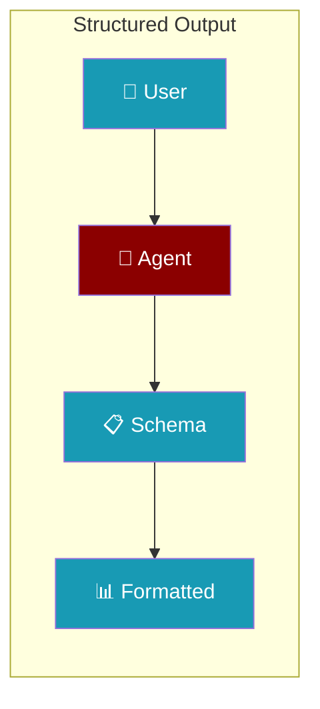
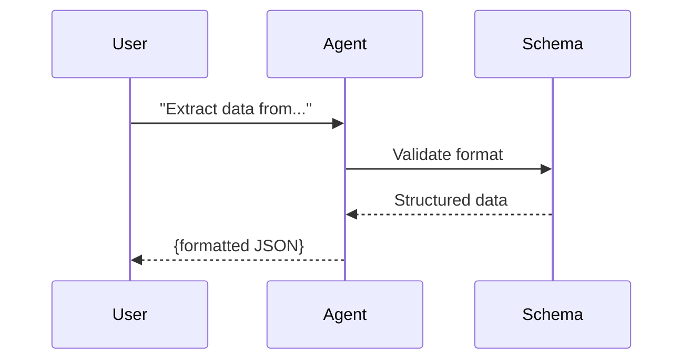

Agents can return structured data in specific formats - JSON, lists, or custom schemas.


```mermaid
graph LR
    subgraph "Structured Output"
        A[👤 User] --> B[🤖 Agent]
        B --> C[📋 Schema]
        C --> D[📊 Formatted]
    end

    classDef agent fill:#8B0000,color:#fff
    classDef tool fill:#189AB4,color:#fff

    class B agent
    class A,C,D tool
```

## Quick Start

<Steps>

<Step title="Simple Usage">
```typescript
import { Agent } from 'praisonai';

const agent = new Agent({
  instructions: 'Extract contact information as JSON.',
  llm: 'gpt-4o-mini',
  outputSchema: {
    type: 'object',
    properties: {
      name: { type: 'string' },
      email: { type: 'string' },
      phone: { type: 'string' }
    },
    required: ['name']
  }
});

const result = await agent.start('John Smith, john@example.com, 555-1234');
// {"name":"John Smith","email":"john@example.com","phone":"555-1234"}
```
</Step>

<Step title="With Configuration">

`outputSchema` takes a JSON Schema object. See [Structured Output](/js/structured-output) for the full API.

```typescript
const agent = new Agent({
  instructions: 'Extract product info',
  llm: 'openai/gpt-4o-mini',
  outputSchema: {
    type: 'object',
    properties: {
      name: { type: 'string' },
      price: { type: 'number' },
      inStock: { type: 'boolean' }
    },
    required: ['name', 'price', 'inStock']
  }
});
```
</Step>

</Steps>

---

## User Interaction Flow


```mermaid
sequenceDiagram
    participant User
    participant Agent
    participant Schema
    
    User->>Agent: "Extract data from..."
    Agent->>Schema: Validate format
    Schema-->>Agent: Structured data
    Agent-->>User: {formatted JSON}
```

---

## Schema-Constrained Output

Pass a JSON Schema object to `outputSchema` and the agent returns a JSON string that matches it.

<Tip>
As of **v1.7.4**, `outputSchema` is wired through OpenAI's `response_format: json_schema`. The agent sends your schema to the model and returns a JSON string that matches it. Use `outputSchemaName` to name the schema in the request payload (default: `"response"`).
</Tip>

`outputSchema` takes a JSON Schema object (`Record<string, any>`). Pass a full JSON Schema for reliable structured output.

```typescript
import { Agent } from 'praisonai';

const agent = new Agent({
  instructions: 'Extract person information from text.',
  llm: 'openai/gpt-4o-mini',
  outputSchema: {
    type: 'object',
    properties: {
      name: { type: 'string' },
      age: { type: 'number' },
      city: { type: 'string' }
    },
    required: ['name', 'age', 'city']
  },
  outputSchemaName: 'Person'  // names the schema in the response_format payload
});

const result = await agent.chat('John is 30 years old and lives in Paris');
// '{"name":"John","age":30,"city":"Paris"}'
```

`agent.chat()` returns the raw JSON string — parse it with `JSON.parse(result)`.

<Info>
`outputSchema` is **OpenAI-only** in v1.7.4. Non-OpenAI providers (`anthropic/...`, `google/...`) log a warning and return unstructured text. See [Structured Output](/js/structured-output) for the full API and provider notes.
</Info>

---

## Output Formats

| Format | Use Case |
|--------|----------|
| `json` | Structured data extraction |
| `markdown` | Formatted documents |
| `text` | Plain text response |
| Schema | Custom typed output |

---

## API Reference

<Card title="OutputConfig" icon="code" href="/sdk/reference/typescript/classes/OutputConfig">
  Output configuration options
</Card>

---

## Best Practices

<AccordionGroup>
  <Accordion title="Use schemas for consistency">
    A JSON Schema ensures the agent returns the same structure every time.
  </Accordion>

  <Accordion title="Keep schemas simple">
    Start with basic types. Deeply nested schemas can confuse some models.
  </Accordion>

  <Accordion title="Mark required fields">
    List the fields you always expect in `required` so they aren't dropped.
  </Accordion>

  <Accordion title="Name your schema">
    Set `outputSchemaName` to label the schema in OpenAI's `response_format` payload. Defaults to `"response"`.
  </Accordion>

  <Accordion title="Use OpenAI for structured output">
    `outputSchema` is OpenAI-native. Non-OpenAI providers warn and answer without the schema — pick an `openai/...` model when you need guaranteed JSON.
  </Accordion>
</AccordionGroup>

---

## Related

<CardGroup cols={2}>
  <Card title="Agent" icon="user" href="/js/agent">
    Create agents
  </Card>
  <Card title="Criteria" icon="check-double" href="/js/criteria">
    Validation rules
  </Card>
</CardGroup>
