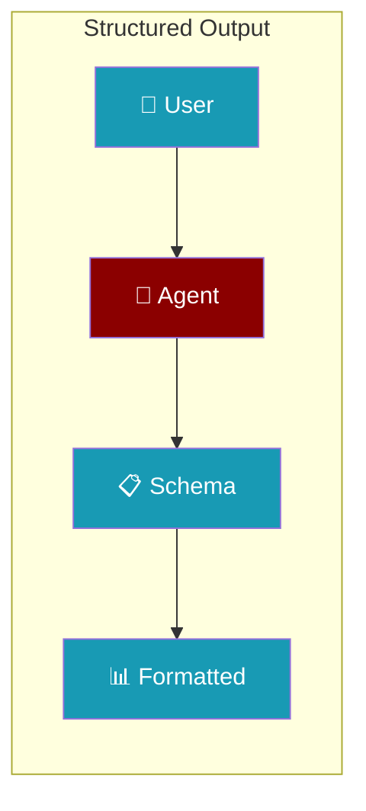
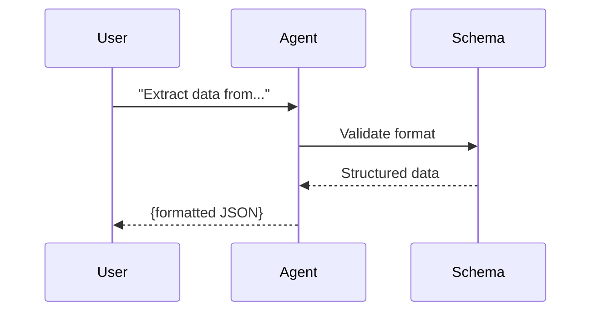

Agents can return structured data in specific formats - JSON, lists, or custom schemas.


```mermaid
graph LR
    subgraph "Structured Output"
        A[👤 User] --> B[🤖 Agent]
        B --> C[📋 Schema]
        C --> D[📊 Formatted]
    end

    classDef agent fill:#8B0000,color:#fff
    classDef tool fill:#189AB4,color:#fff

    class B agent
    class A,C,D tool
```

## Quick Start

<Steps>

<Step title="Simple Usage">
```typescript
import { Agent } from 'praisonai';

const agent = new Agent({
  instructions: 'Extract contact information as JSON.',
  llm: 'gpt-4o-mini',
  outputSchema: {
    type: 'object',
    properties: {
      name: { type: 'string' },
      email: { type: 'string' },
      phone: { type: 'string' }
    },
    required: ['name']
  }
});

const result = await agent.start('John Smith, john@example.com, 555-1234');
// {"name":"John Smith","email":"john@example.com","phone":"555-1234"}
```
</Step>

<Step title="With Configuration">

`outputSchema` takes a JSON Schema object. See [Structured Output](/js/structured-output) for the full API.

```typescript
const agent = new Agent({
  instructions: 'Extract product info',
  outputSchema: {
    type: 'object',
    properties: {
      name: { type: 'string' },
      price: { type: 'number' },
      inStock: { type: 'boolean' }
    },
    required: ['name', 'price']
  }
});
```
</Step>

</Steps>

---

## User Interaction Flow


```mermaid
sequenceDiagram
    participant User
    participant Agent
    participant Schema
    
    User->>Agent: "Extract data from..."
    Agent->>Schema: Validate format
    Schema-->>Agent: Structured data
    Agent-->>User: {formatted JSON}
```

---

## Schema-Constrained Output

Pass a JSON Schema object to `outputSchema` and the agent returns a JSON string that matches it.

```typescript
import { Agent } from 'praisonai';

const agent = new Agent({
  instructions: 'Summarise the text.',
  llm: 'gpt-4o-mini',
  outputSchema: {
    type: 'object',
    properties: {
      title: { type: 'string' },
      points: { type: 'array', items: { type: 'string' } },
      score: { type: 'number' }
    },
    required: ['title', 'points']
  }
});

const json = await agent.start('Summarise: ...');
const summary = JSON.parse(json);
```

<Info>
`outputSchema` is **OpenAI-only** in v1.7.4. Non-OpenAI providers log a warning and return unstructured text. See [Structured Output](/js/structured-output) for the full API and provider notes.
</Info>

---

## Best Practices

<AccordionGroup>
  <Accordion title="Use schemas for consistency">
    A JSON Schema ensures the agent returns the same structure every time.
  </Accordion>

  <Accordion title="Keep schemas simple">
    Start with basic types. Deeply nested schemas can confuse some models.
  </Accordion>

  <Accordion title="Mark required fields">
    List the fields you always expect in `required` so they aren't dropped.
  </Accordion>
</AccordionGroup>

---

## Related

<CardGroup cols={2}>
  <Card title="Agent" icon="user" href="/js/agent">
    Create agents
  </Card>
  <Card title="Criteria" icon="check-double" href="/js/criteria">
    Validation rules
  </Card>
</CardGroup>
