Output formatting lets you get structured data from agents - JSON, lists, specific formats.

```mermaid
graph LR
    subgraph "Structured Output"
        A[🤖 Agent] --> B[📋 Format]
        B --> C[📊 JSON]
        B --> D[📝 List]
        B --> E[📄 Custom]
    end
    
    classDef agent fill:#6366F1,stroke:#7C90A0,color:#fff
    classDef format fill:#F59E0B,stroke:#7C90A0,color:#fff
    classDef output fill:#10B981,stroke:#7C90A0,color:#fff
    
    class A agent
    class B format
    class C,D,E output
```



## Quick Start

<Steps>

<Step title="Get JSON Output">
```typescript
import { Agent } from 'praisonai';

const agent = new Agent({
  instructions: 'You analyze products',
  outputFormat: 'json'
});

const result = await agent.chat('Analyze this laptop specs');
// Returns structured JSON
```
</Step>

<Step title="Define Schema">
```typescript
const agent = new Agent({
  instructions: 'Extract contact information',
  outputSchema: {
    type: 'object',
    properties: {
      name: { type: 'string' },
      email: { type: 'string' },
      phone: { type: 'string' }
    }
  }
});

const contact = await agent.chat('John Doe, john@email.com, 555-1234');
// { name: "John Doe", email: "john@email.com", phone: "555-1234" }
```
</Step>

</Steps>

---

## Output Formats

| Format | Best For |
|--------|----------|
| `text` | Free-form responses (default) |
| `json` | Structured data |
| `markdown` | Formatted text |
| Custom schema | Specific data structures |

---

## Common Examples

### Product Analysis

```typescript
const agent = new Agent({
  outputSchema: {
    type: 'object',
    properties: {
      name: { type: 'string' },
      price: { type: 'number' },
      rating: { type: 'number' },
      pros: { type: 'array', items: { type: 'string' } },
      cons: { type: 'array', items: { type: 'string' } }
    }
  }
});

const analysis = await agent.chat('Review: iPhone 15 Pro');
console.log(analysis.pros);  // ["Great camera", ...]
```

### Extract List

```typescript
const agent = new Agent({
  instructions: 'Extract action items from meeting notes',
  outputSchema: {
    type: 'array',
    items: {
      type: 'object',
      properties: {
        task: { type: 'string' },
        assignee: { type: 'string' },
        deadline: { type: 'string' }
      }
    }
  }
});
```

---

## Best Practices

<AccordionGroup>
  <Accordion title="Use schemas for complex data">
    When you need specific fields, define a schema to ensure consistent output structure.
  </Accordion>
  
  <Accordion title="Keep schemas simple">
    Complex nested schemas can confuse models. Start simple and add complexity as needed.
  </Accordion>
  
  <Accordion title="Validate output">
    Always validate the returned data matches your expected format before using it.
  </Accordion>
</AccordionGroup>

---

## Related

<CardGroup cols={2}>
  <Card title="Agent" icon="user" href="/docs/js/agent">
    Create AI agents
  </Card>
  <Card title="Guardrails" icon="shield" href="/docs/js/guardrails">
    Validate responses
  </Card>
</CardGroup>
