Agents can return structured data in specific formats - JSON, lists, or custom schemas.

```mermaid
graph LR
    subgraph "Structured Output"
        A[👤 User] --> B[🤖 Agent]
        B --> C[📋 Schema]
        C --> D[📊 Formatted]
    end
    
    classDef user fill:#6366F1,stroke:#7C90A0,color:#fff
    classDef agent fill:#F59E0B,stroke:#7C90A0,color:#fff
    classDef output fill:#10B981,stroke:#7C90A0,color:#fff
    
    class A user
    class B agent
    class C,D output
```



## Quick Start

<Steps>

<Step title="JSON Output">
```typescript
import { Agent } from 'praisonai';

const agent = new Agent({
  instructions: 'Extract contact information',
  outputFormat: 'json'
});

const result = await agent.chat('John Smith, john@example.com, 555-1234');
// { name: "John Smith", email: "john@example.com", phone: "555-1234" }
```
</Step>

<Step title="With Schema">
```typescript
const agent = new Agent({
  instructions: 'Extract product info',
  outputSchema: {
    name: 'string',
    price: 'number',
    inStock: 'boolean'
  }
});
```
</Step>

</Steps>

---

## User Interaction Flow


---

## Configuration Levels

```typescript
// Level 1: String - Simple format
const agent = new Agent({
  outputFormat: 'json'  // or 'markdown', 'text'
});

// Level 2: Dict - Schema definition
const agent = new Agent({
  outputSchema: {
    title: 'string',
    points: 'string[]',
    score: 'number'
  }
});

// Level 3: Instance - Full control with Zod
import { z } from 'zod';

const agent = new Agent({
  outputSchema: z.object({
    title: z.string(),
    points: z.array(z.string()),
    score: z.number().min(0).max(100)
  })
});
```

---

## Output Formats

| Format | Use Case |
|--------|----------|
| `json` | Structured data extraction |
| `markdown` | Formatted documents |
| `text` | Plain text response |
| Schema | Custom typed output |

---

## API Reference

<Card title="OutputConfig" icon="code" href="/docs/sdk/reference/typescript/classes/OutputConfig">
  Output configuration options
</Card>

---

## Best Practices

<AccordionGroup>
  <Accordion title="Use schemas for consistency">
    Schemas ensure agents return predictable structures every time.
  </Accordion>
  
  <Accordion title="Keep schemas simple">
    Start with basic types. Complex nested schemas may confuse some models.
  </Accordion>
  
  <Accordion title="Validate with Zod">
    Zod schemas provide runtime type checking for extra safety.
  </Accordion>
</AccordionGroup>

---

## Related

<CardGroup cols={2}>
  <Card title="Agent" icon="user" href="/docs/js/agent">
    Create agents
  </Card>
  <Card title="Criteria" icon="check-double" href="/docs/js/criteria">
    Validation rules
  </Card>
</CardGroup>
