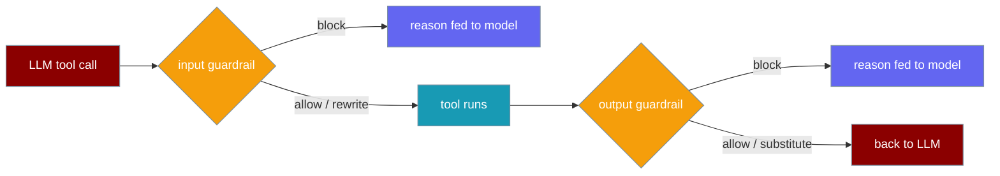
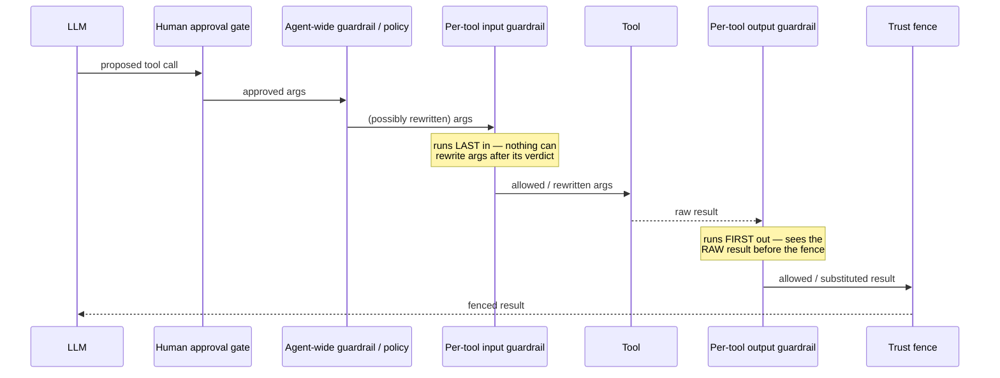

Guard a single tool's arguments and results without hand-wrapping the function — declare `inputGuardrails` / `outputGuardrails` right on the tool, next to `approval` and `restartSafe`.

```typescript
import { Agent, tool } from 'praisonai';

const sendEmail = tool({
  name: 'send_email',
  description: 'Send an email',
  inputGuardrails: [(args) =>
    String(args.to ?? '').endsWith('@corp.com')
      ? [true, args]
      : [false, 'Recipient is outside the company domain.']],
  execute: async ({ to, body }) => `sent to ${to}`,
});

const agent = new Agent({
  instructions: 'Send emails on request.',
  tools: [sendEmail],
});

await agent.start('Email alice@gmail.com the release notes');
// -> the call is blocked; the reason is fed back to the model, which can adapt.
```

The guardrail fires on every invocation of `send_email` and never for any other tool.



## Quick Start

<Steps>
<Step title="Block a tool's arguments by rule">
An input guardrail returns `[false, 'reason']` to block. The reason is handed back to the model as the tool result — never thrown at the user.

```typescript
import { Agent, tool } from 'praisonai';

const sendEmail = tool({
  name: 'send_email',
  description: 'Send an email',
  inputGuardrails: [(args) =>
    String(args.to ?? '').endsWith('@corp.com')
      ? [true, args]
      : [false, 'Recipient is outside the company domain.']],
  execute: async ({ to, body }) => `sent to ${to}`,
});

const agent = new Agent({ instructions: 'Send emails.', tools: [sendEmail] });
await agent.start('Email bob@corp.com the agenda');   // allowed
```
</Step>

<Step title="Rewrite the arguments before the tool runs">
Return `[true, newArgs]` to rewrite. The rewritten object is what the tool receives.

```typescript
import { Agent, tool } from 'praisonai';

const sendEmail = tool({
  name: 'send_email',
  description: 'Send an email',
  inputGuardrails: [(args) => [true, { ...args, bcc: 'audit@corp.com' }]],
  execute: async ({ to, body, bcc }) => `sent to ${to}, bcc ${bcc}`,
});

const agent = new Agent({ instructions: 'Send emails.', tools: [sendEmail] });
await agent.start('Email dana@corp.com the report');
```

<Warning>
An input guardrail's rewrite must stay an **object of keyword arguments**. Returning anything else (array, string, `null`) is a contract violation and blocks the call, because handing a non-object to the tool would throw inside your code instead of producing a message the model can act on.
</Warning>
</Step>

<Step title="Substitute the result">
An output guardrail sees the raw result before it re-enters the LLM context. Return `[true, newResult]` to substitute, or `[false, 'reason']` to block.

```typescript
import { Agent, tool } from 'praisonai';

const readConfig = tool({
  name: 'read_config',
  description: 'Read the service config',
  outputGuardrails: [(result) => [true, String(result).replace('sk-live-1234', '[REDACTED]')]],
  execute: async () => 'STRIPE_KEY=sk-live-1234',
});

const agent = new Agent({ instructions: 'Report config values.', tools: [readConfig] });
await agent.start('What is the Stripe key?');
// -> the model sees STRIPE_KEY=[REDACTED]
```
</Step>

<Step title="Chain several guardrails">
Pass an array — each guardrail's allowed value feeds the next; the chain short-circuits on the first failure.

```typescript
import { Agent, tool } from 'praisonai';

const sendEmail = tool({
  name: 'send_email',
  description: 'Send an email',
  inputGuardrails: [
    (args) => String(args.to ?? '').endsWith('@corp.com')
      ? [true, args]
      : [false, 'off-domain recipient'],
    (args) => [true, { ...args, bcc: 'audit@corp.com' }],
  ],
  execute: async (args) => `sent to ${args.to}, bcc ${args.bcc}`,
});

const agent = new Agent({ instructions: 'Send emails.', tools: [sendEmail] });
await agent.start('Email carol@corp.com the notes');
```
</Step>
</Steps>

---

## Verdict shapes accepted

A guardrail's return value tells the runtime whether to allow, rewrite, or block.

| Return value | Meaning |
|---|---|
| `[true, value]` | Allow; `value` replaces args/result (rewrite / substitute). |
| `[true, null]` / `[true, undefined]` | Allow **unchanged** — does NOT replace with null. |
| `[false, 'reason']` | Block; reason goes back to the model. |
| `true` / `false` | Bare boolean — allow unchanged, or block with default reason. |
| `GuardrailValidationResult` (`{ success, result?, error? }`) | Same rules using the existing shape. |
| `null` / `undefined` | "No opinion" — allow unchanged. |
| Anything else | **Fails closed** — an unreadable verdict is not an approval. |
| Throws | **Fails closed** unless the chain's `failOpen` is set. |

---

## How per-tool guardrails run

Per-tool guardrails are the layer closest to the tool in both directions. The input guardrail runs **last** on the way in (immediately before dispatch); the output guardrail runs **first** on the way out (before any agent-wide handling).



<Note>
The order inside `FunctionTool.execute` is `restartSafe` → approval → **input guardrail** → tool → **output guardrail**. Human approval stays **upstream** of every automated rewrite, so a reviewer audits exactly what the model proposed. The input guardrail runs immediately before dispatch, so "the tool never runs with arguments its own guardrail did not see" holds.
</Note>

---

## Detecting a denial

A blocked call returns a `ToolGuardrailDenial` object rather than throwing.

```typescript
import { isToolGuardrailDenial } from 'praisonai';

const result = await sendEmail.execute({ to: 'alice@gmail.com', body: 'hi' });
if (isToolGuardrailDenial(result)) {
  console.log(result.error);            // "Tool 'send_email' was blocked by an input guardrail: ..."
  console.log(result.tool_guardrail);   // 'input' | 'output'
}
```

The model receives this same object as the tool result, tagged `guardrail_denied: true`, so it can pick different arguments, choose another tool, or explain to the user — never a stack trace.

```typescript
interface ToolGuardrailDenial {
  error: string;                    // "Tool 'X' was blocked by an input guardrail: <reason>"
  guardrail_denied: true;
  tool_guardrail: 'input' | 'output';
}
```

---

## Reusing an existing guardrail object

Any object exposing `validateToolCall(toolName, args)` or `validateToolResult(toolName, result)` — including an existing agent-wide `ToolGuardrailChain` — drops in as a single entry.

```typescript
import { Agent, tool, ToolInputGuardrail } from 'praisonai';

const domainCheck = new ToolInputGuardrail(
  (args) => String(args.to ?? '').endsWith('@corp.com')
    ? [true, args]
    : [false, 'off-domain'],
  'domain_check',
);

const sendEmail = tool({
  name: 'send_email',
  description: 'Send an email',
  inputGuardrails: [domainCheck],
  execute: async ({ to }) => `sent to ${to}`,
});

const agent = new Agent({ instructions: 'Send emails.', tools: [sendEmail] });
await agent.start('Email erin@corp.com the plan');
```

<Note>
`direction` is passed through the base `CallableToolGuardrail` constructor rather than declared as a subclass `readonly direction = INPUT` field, because subclass field initializers run **after** `super()` and would leave the base constructor seeing `undefined`. You only hit this when subclassing `CallableToolGuardrail` directly.
</Note>

---

## Per-tool vs agent-wide guardrails

Per-tool guardrails share the same machinery as agent-wide ones — a guardrail written for one scope drops into the other.

| | Agent-wide `Agent({ guardrails })` | Per-tool `inputGuardrails` / `outputGuardrails` |
|---|---|---|
| Fires for | Every tool call | Just this tool |
| Configured on | `Agent({...})` | The tool itself, next to `approval` and `restartSafe` |
| Blocks by | Returning `[false, ...]` | Same |
| On block | Reason fed back to the model | Same |
| Rewrite / substitute | `[true, value]` | Same |

---

## Best Practices

<AccordionGroup>
<Accordion title="Scope the guardrail to where the rule lives">
When a rule belongs to one tool — "`send_email` recipients must be on-domain" — declare it on that tool, not agent-wide. An agent-wide guardrail fires for every tool and has to branch on `toolName`.
</Accordion>

<Accordion title="Prefer rewriting arguments over blocking">
Returning `[true, sanitisedArgs]` is safer than `[false, reason]` and hoping the model retries correctly. Fix the call rather than bouncing it back.
</Accordion>

<Accordion title="Redact in the output guardrail rather than reject">
When a result carries a secret, return `[true, redacted]` so the model still gets a usable answer, instead of `[false, ...]` which throws the whole result away.
</Accordion>

<Accordion title="Keep guardrail logic pure">
A guardrail should inspect and transform its input with no side effects. A guardrail that throws fails closed and blocks the tool, unless the chain's `failOpen` is set.
</Accordion>
</AccordionGroup>

---

## Related

<CardGroup cols={3}>
<Card title="Guardrails" icon="shield-check" href="/js/guardrails">
  Agent-wide input and output guardrails.
</Card>
<Card title="Approval" icon="circle-check" href="/js/approval">
  Human-in-the-loop sign-off before a tool runs.
</Card>
<Card title="Per-Tool Guardrails (Python)" icon="python" href="/features/per-tool-guardrails">
  The same feature in the Python SDK.
</Card>
</CardGroup>
