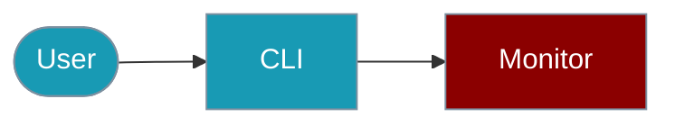

Track and export Agent performance metrics from the command line.



## Quick Start

<Steps>

<Step title="Simple Usage">

```bash
npx praisonai telemetry performance start
```

</Step>

<Step title="With Configuration">

```bash
npx praisonai telemetry performance metric llm_latency 150
npx praisonai telemetry performance timer start agent_response
npx praisonai telemetry performance timer stop agent_response
```

</Step>

</Steps>

## Start Monitoring

```bash
# Start performance monitor
npx praisonai telemetry performance start

# Record a metric
npx praisonai telemetry performance metric llm_latency 150

# Start a timer
npx praisonai telemetry performance timer start agent_response
npx praisonai telemetry performance timer stop agent_response
```

## View Stats

```bash
# Show all stats
npx praisonai telemetry performance stats

# Show specific metric
npx praisonai telemetry performance stats llm_latency

# Show summary dashboard
npx praisonai telemetry performance dashboard
```

## Export Metrics

```bash
# Export as JSON
npx praisonai telemetry performance export --json

# Export for Prometheus
npx praisonai telemetry performance export --prometheus

# Save to file
npx praisonai telemetry performance export --output metrics.json
```

## Live Monitoring

```bash
# Watch metrics in real-time
npx praisonai telemetry performance watch

# Watch with refresh interval
npx praisonai telemetry performance watch --interval 5
```

## Programmatic (TypeScript)

```typescript
import { PerformanceMonitor, createPerformanceMonitor } from 'praisonai';

const monitor = createPerformanceMonitor();
monitor.record('latency', 150);
console.log(monitor.getStats('latency'));
```

## Related

<CardGroup cols={2}>
  <Card title="Performance Monitor" icon="gauge-high" href="/docs/js/performance-monitor">
    SDK documentation
  </Card>
  <Card title="Observability CLI" icon="terminal" href="/docs/js/observability-cli">
    Full observability
  </Card>
</CardGroup>
