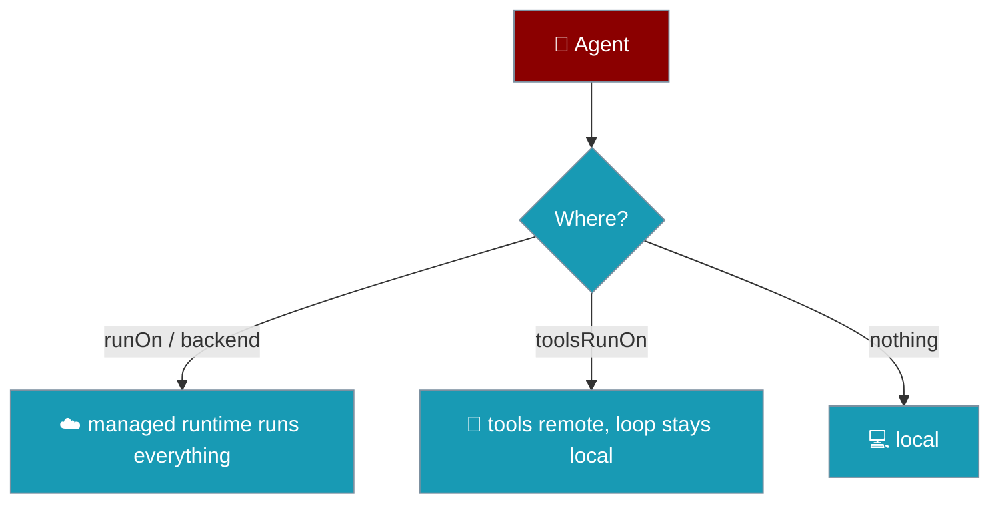

Placement answers one question — *where does this run?* — along two axes: the whole agent (`runOn` / `backend`) or only its tools (`toolsRunOn`).



## Quick Start

<Steps>

<Step title="A custom backend runs the whole agent">
```typescript
import { Agent } from 'praisonai';

const agent = new Agent({
  instructions: 'Hosted agent',
  backend: {
    async execute(prompt) {
      return `handled remotely: ${prompt}`;
    },
  },
});
await agent.chat('Do the work');
```
</Step>

<Step title="Only the tools run elsewhere">
```typescript
import { Agent } from 'praisonai';

// 'local' is always registered; register others with registerToolPlace
const agent = new Agent({ instructions: 'Local loop', toolsRunOn: 'local' });
```
</Step>

</Steps>

---

## The two axes

| Option | Type | Meaning |
|---|---|---|
| `runOn` | `string \| ManagedBackendLike` | Names a **managed runtime** that hosts the whole agent — model calls, loop and tools. `runOn: 'x'` is shorthand for `backend: <hosted agent for x>`. |
| `backend` | `ManagedBackendLike` | A custom object exposing `execute(prompt, options)` (and optional `stream()`, `managedSessionId`). |
| `toolsRunOn` | `string \| ToolPlaceLike` | Names a **tool place** — the tools run there, thinking stays local. |

`ManagedBackendLike` and `ToolPlaceLike` are exported interfaces. The default place, `LOCAL_TOOL_PLACE`, runs a tool unchanged in this process.

## Exclusion rules

The two axes are disjoint, so naming two places for the same thing is a typo worth catching. Any of these throws at construction:

<Warning>
```text
TypeError: Agent(runOn, backend) sets the agent's runtime twice. ...
TypeError: Agent(runOn, toolsRunOn) points the tools at two machines. ...
TypeError: Agent(backend, toolsRunOn) points the tools at two machines: ...

# a name used on the wrong axis
TypeError: Agent(runOn: 'X') is not a known managed runtime. ...
TypeError: Agent(runOn: 'X') is not valid: runOn places the whole agent ... use toolsRunOn
TypeError: Agent(toolsRunOn: 'X') is not valid: 'X' hosts an entire agent, not individual tools.
TypeError: Agent(toolsRunOn: 'X') is not a known place. ...

# a backend without execute()
TypeError: Agent(backend) does not support execute(): a managed backend must expose execute(prompt, options) returning the response.
```
</Warning>

Before this change a mis-typed name survived construction and only surfaced on the first model turn — after the prompt was built and, for a real run, after the API spend. Validation now happens at the call site.

## Registering hosts

A hosted runtime and a remote tool place are provider integrations that do not ship in the package. A host fills the registries:

```typescript
import { registerManagedRuntime, registerToolPlace } from 'praisonai';

registerManagedRuntime('my-runtime', () => ({
  async execute(prompt) { return `ran ${String(prompt)}`; },
}));

registerToolPlace('my-sandbox', () => ({
  placeName: 'my-sandbox',
  async runTool(_name, _args, run) { return run(); },
}));
```

Once registered, `runOn: 'my-runtime'` and `toolsRunOn: 'my-sandbox'` resolve by name. `unregisterManagedRuntime` / `unregisterToolPlace` undo a registration (`local` cannot be removed).

## Reading the resolved placement

```typescript
import { Agent } from 'praisonai';

const agent = new Agent({ instructions: 'x', toolsRunOn: 'local' });
console.log(agent.getManagedBackend()); // undefined
console.log(agent.getToolPlace());      // the 'local' place
```

## Related

<CardGroup cols={2}>
  <Card title="Runtime" icon="gears" href="/js/runtime">
    Delegate the whole turn
  </Card>
  <Card title="Sandbox" icon="box" href="/js/sandbox">
    Where code runs
  </Card>
</CardGroup>
