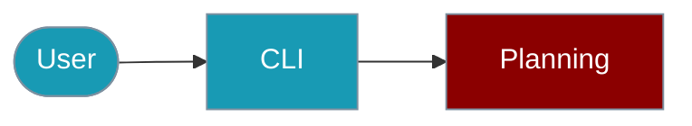

The `praisonai-ts` CLI provides commands for task planning and todo management.



## Quick Start

<Steps>

<Step title="Simple Usage">

```bash
praisonai-ts planning create "My Project Plan"
```

</Step>

<Step title="With Configuration">

```bash
praisonai-ts planning create "Build Pipeline" --json
praisonai-ts planning todo add "Complete documentation"
```

</Step>

</Steps>

## Create Plan

```bash
# Create a new plan
praisonai-ts planning create "My Project Plan"

# Get JSON output
praisonai-ts planning create "Build Pipeline" --json
```

## Todo Management

```bash
# Add a todo item
praisonai-ts planning todo add "Complete documentation"

# List todo items
praisonai-ts planning todo list

# Get JSON output
praisonai-ts planning todo list --json
```

## SDK Usage

For programmatic planning:

```typescript
import { Plan, PlanStep, TodoList, TodoItem } from 'praisonai';

// Create a plan
const plan = new Plan({ name: 'Build Pipeline' });
plan.addStep(new PlanStep({ description: 'Compile' }));
plan.addStep(new PlanStep({ description: 'Test' }));
plan.addStep(new PlanStep({ description: 'Deploy' }));

// Execute steps
plan.start();
plan.steps[0].start();
plan.steps[0].complete();
console.log('Progress:', plan.getProgress());

// Create todo list
const todos = new TodoList('Tasks');
todos.add(new TodoItem({ content: 'Task 1', priority: 'high' }));
todos.add(new TodoItem({ content: 'Task 2', priority: 'low' }));

// Complete items
todos.items[0].complete();
console.log('Progress:', todos.getProgress());
```

For more details, see the [Planning SDK documentation](/docs/js/planning).

## Related

<CardGroup cols={2}>
  <Card title="Planning SDK" icon="list-check" href="/docs/js/planning">
    Programmatic planning
  </Card>
  <Card title="Workflows" icon="diagram-project" href="/docs/js/workflows">
    Orchestrate pipelines
  </Card>
</CardGroup>
