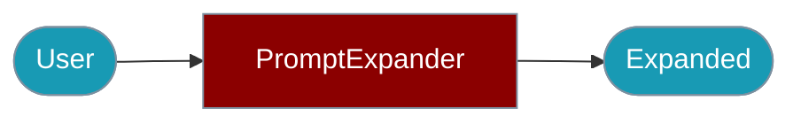

Expand and enhance prompts with more detail and context for your Agents.



## Quick Start

<Steps>

<Step title="Simple Usage">

```typescript
import { PromptExpanderAgent } from 'praisonai';

const agent = new PromptExpanderAgent();

const result = await agent.expand('Write code');
console.log(result.expanded);
```

</Step>

<Step title="With Configuration">

```typescript
import { PromptExpanderAgent } from 'praisonai';

const agent = new PromptExpanderAgent({
  name: 'MyExpander',
  llm: 'openai/gpt-4o',
  defaultStrategy: 'detail',
  verbose: true
});

const result = await agent.expand('Create a function');
console.log(result);
```

</Step>

</Steps>

## Installation

```bash
npm install praisonai
```

## With Custom Configuration

```typescript
import { PromptExpanderAgent } from 'praisonai';

const agent = new PromptExpanderAgent({
  name: 'MyExpander',
  llm: 'openai/gpt-4o',
  defaultStrategy: 'detail',
  verbose: true
});

const result = await agent.expand('Create a function');
console.log(result);
```

## Expansion Strategies

```typescript
import { PromptExpanderAgent } from 'praisonai';

const agent = new PromptExpanderAgent();

// Detail strategy - adds specific details
const detail = await agent.expand('Write code', 'detail');

// Context strategy - adds background context
const context = await agent.expand('Explain this', 'context');

// Examples strategy - adds concrete examples
const examples = await agent.expand('Show me how', 'examples');

// Constraints strategy - adds requirements
const constraints = await agent.expand('Build a system', 'constraints');

// Auto strategy - detects best approach
const auto = await agent.expand('Do something', 'auto');
```

## Strategy Detection

```typescript
import { PromptExpanderAgent } from 'praisonai';

const agent = new PromptExpanderAgent();

// Automatically detects appropriate strategy
const strategy = agent.detectStrategy('Write code');
console.log(strategy); // 'detail'

const strategy2 = agent.detectStrategy('Explain why this matters');
console.log(strategy2); // 'context'
```

## Result Structure

```typescript
interface ExpandResult {
  original: string;      // Original prompt
  expanded: string;      // Expanded prompt
  strategy: ExpandStrategy;  // Strategy used
  additions: string[];   // New elements added
}
```

## Factory Function

```typescript
import { createPromptExpanderAgent } from 'praisonai';

const agent = createPromptExpanderAgent({
  name: 'Expander',
  verbose: true
});
```

## Related

<CardGroup cols={2}>
  <Card title="Prompt Expander CLI" icon="terminal" href="/docs/js/prompt-expander-cli">
    CLI commands
  </Card>
  <Card title="Agent" icon="robot" href="/docs/js/agent">
    Agent configuration
  </Card>
</CardGroup>
