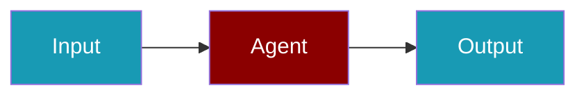

# AssemblyAI CLI Commands

## Environment Setup

```bash
export ASSEMBLYAI_API_KEY=...
```

## Commands

```bash
praisonai-ts providers doctor assemblyai
praisonai-ts providers doctor assemblyai --json
```

## Related

<CardGroup cols={2}>
  <Card title="AssemblyAI Code Usage" icon="book" href="/docs/js/providers/assemblyai-code">
    AssemblyAI Code Usage
  </Card>
</CardGroup>
