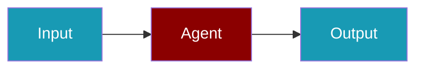

# AssemblyAI Provider

Speech-to-text with AssemblyAI.

## Environment Variables

```bash
export ASSEMBLYAI_API_KEY=...
```

## Quick Start

<Steps>
<Step title="Simple Usage">
```typescript
import { Agent } from 'praisonai';

const agent = new Agent({
  name: 'TranscriptionAgent',
  instructions: 'Transcribe audio.',
  llm: 'assemblyai/best'
});
```
</Step>
<Step title="With Configuration">
Adjust provider credentials and model settings for production — see the sections above.
</Step>
</Steps>

## Related

<CardGroup cols={2}>
  <Card title="AssemblyAI CLI Usage" icon="terminal" href="/docs/js/providers/assemblyai-cli">
    AssemblyAI CLI Usage
  </Card>
</CardGroup>
