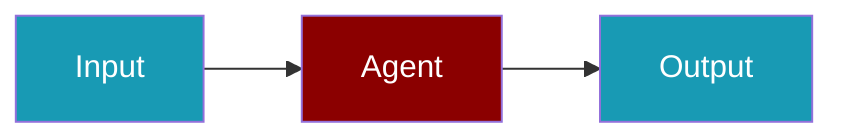

# Cerebras CLI Commands

## Environment Setup

```bash
export CEREBRAS_API_KEY=...
```

## Commands

```bash
praisonai-ts providers doctor cerebras
praisonai-ts providers test cerebras llama3.3-70b
praisonai-ts providers doctor cerebras --json
```

## Related

<CardGroup cols={2}>
  <Card title="Cerebras Code Usage" icon="book" href="/docs/js/providers/cerebras-code">
    Cerebras Code Usage
  </Card>
</CardGroup>
