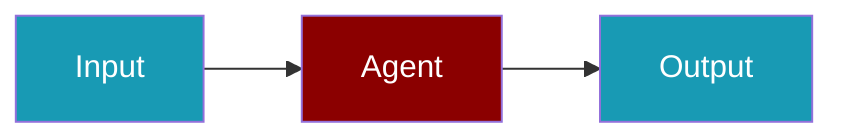

# Deepgram CLI Commands

## Environment Setup

```bash
export DEEPGRAM_API_KEY=...
```

## Commands

```bash
praisonai-ts providers doctor deepgram
praisonai-ts providers doctor deepgram --json
```

## Related

<CardGroup cols={2}>
  <Card title="Deepgram Code Usage" icon="book" href="/docs/js/providers/deepgram-code">
    Deepgram Code Usage
  </Card>
</CardGroup>
