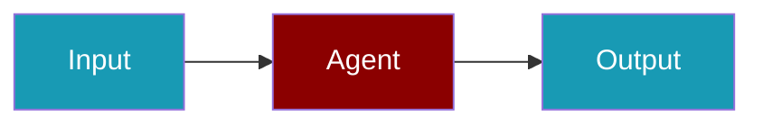

# DeepInfra CLI Commands

## Environment Setup

```bash
export DEEPINFRA_API_KEY=...
```

## Commands

```bash
praisonai-ts providers doctor deepinfra
praisonai-ts providers test deepinfra meta-llama/Llama-2-70b-chat-hf
praisonai-ts providers doctor deepinfra --json
```

## Related

<CardGroup cols={2}>
  <Card title="DeepInfra Code Usage" icon="book" href="/docs/js/providers/deepinfra-code">
    DeepInfra Code Usage
  </Card>
</CardGroup>
