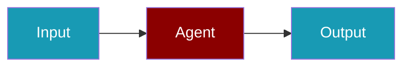

# DeepInfra Provider

Fast inference with DeepInfra.

## Environment Variables

```bash
export DEEPINFRA_API_KEY=...
```

## Quick Start

<Steps>
<Step title="Simple Usage">
```typescript
import { Agent } from 'praisonai';

const agent = new Agent({
  name: 'DeepInfraAgent',
  instructions: 'You are a helpful assistant.',
  llm: 'deepinfra/meta-llama/Llama-2-70b-chat-hf'
});

const response = await agent.chat('Hello!');
```
</Step>
<Step title="With Configuration">
Adjust provider credentials and model settings for production — see the sections above.
</Step>
</Steps>

## Related

<CardGroup cols={2}>
  <Card title="DeepInfra CLI Usage" icon="terminal" href="/docs/js/providers/deepinfra-cli">
    DeepInfra CLI Usage
  </Card>
</CardGroup>
