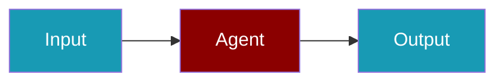

# ElevenLabs CLI Commands

## Environment Setup

```bash
export ELEVENLABS_API_KEY=...
```

## Commands

```bash
praisonai-ts providers doctor elevenlabs
praisonai-ts providers doctor elevenlabs --json
```

## Related

<CardGroup cols={2}>
  <Card title="ElevenLabs Code Usage" icon="book" href="/docs/js/providers/elevenlabs-code">
    ElevenLabs Code Usage
  </Card>
</CardGroup>