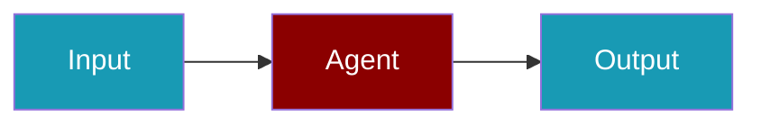

# Fal CLI Commands

## Environment Setup

```bash
export FAL_KEY=...
```

## Commands

```bash
praisonai-ts providers doctor fal
praisonai-ts providers doctor fal --json
```

## Related

<CardGroup cols={2}>
  <Card title="Fal Code Usage" icon="book" href="/docs/js/providers/fal-code">
    Fal Code Usage
  </Card>
</CardGroup>