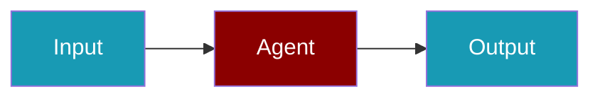

# FriendliAI CLI Commands

## Environment Setup

```bash
export FRIENDLI_TOKEN=...
```

## Commands

```bash
praisonai-ts providers doctor friendliai
praisonai-ts providers doctor friendliai --json
```

## Related

<CardGroup cols={2}>
  <Card title="FriendliAI Code Usage" icon="book" href="/docs/js/providers/friendliai-code">
    FriendliAI Code Usage
  </Card>
</CardGroup>