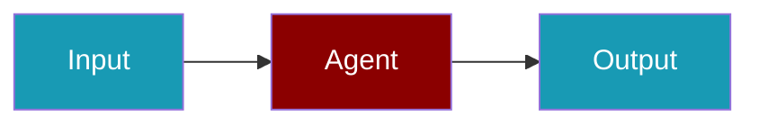

# Google Provider

Use Google's Gemini models including Gemini 2.0 Flash and Gemini 1.5 Pro.

## Environment Variables

```bash
export GOOGLE_GENERATIVE_AI_API_KEY=AIza...
# or
export GOOGLE_API_KEY=AIza...
```

| Variable | Required | Description |
|----------|----------|-------------|
| `GOOGLE_GENERATIVE_AI_API_KEY` | Yes | Google AI Studio API key |
| `GOOGLE_API_KEY` | Alt | Alternative env var name |

## Supported Modalities

| Modality | Supported |
|----------|-----------|
| Text/Chat | ✅ |
| Embeddings | ✅ |
| Image | ✅ |
| Audio | ✅ |
| Speech | ✅ |
| Tools | ✅ |

## Quick Start

<Steps>
<Step title="Simple Usage">
```typescript
import { Agent } from 'praisonai';

const agent = new Agent({
  name: 'Gemini',
  instructions: 'You are a helpful assistant.',
  llm: 'google/gemini-2.0-flash'
});

const response = await agent.chat('Hello!');
console.log(response);
```
</Step>
<Step title="With Configuration">
Adjust provider credentials and model settings for production — see the sections above.
</Step>
</Steps>

## Available Models

| Model | Description | Context |
|-------|-------------|---------|
| `gemini-2.0-flash` | Latest fast model | 1M |
| `gemini-1.5-pro` | Most capable | 2M |
| `gemini-1.5-flash` | Fast, efficient | 1M |
| `gemini-1.5-flash-8b` | Lightweight | 1M |

## Advanced Configuration

```typescript
import { Agent } from 'praisonai';

const agent = new Agent({
  name: 'GeminiPro',
  instructions: 'You are an expert analyst.',
  llm: 'google/gemini-1.5-pro',
  llmConfig: {
    temperature: 0.7,
    maxTokens: 8192,
  }
});
```

## With Tools

```typescript
import { Agent } from 'praisonai';

const weatherTool = {
  name: 'get_weather',
  description: 'Get current weather',
  parameters: {
    type: 'object',
    properties: {
      location: { type: 'string', description: 'City name' }
    },
    required: ['location']
  },
  execute: async ({ location }) => {
    return `Weather in ${location}: Sunny, 72°F`;
  }
};

const agent = new Agent({
  name: 'WeatherGemini',
  instructions: 'Help with weather queries.',
  llm: 'google/gemini-2.0-flash',
  tools: [weatherTool]
});
```

## Vision (Image Input)

```typescript
import { Agent } from 'praisonai';

const agent = new Agent({
  name: 'VisionGemini',
  instructions: 'Analyze images.',
  llm: 'google/gemini-1.5-pro'
});

const response = await agent.chat({
  content: 'Describe this image',
  images: ['https://example.com/image.jpg']
});
```

## Streaming

```typescript
import { Agent } from 'praisonai';

const agent = new Agent({
  name: 'StreamGemini',
  instructions: 'You are helpful.',
  llm: 'google/gemini-2.0-flash'
});

for await (const chunk of agent.stream('Tell me a story')) {
  process.stdout.write(chunk);
}
```

## Troubleshooting

### Invalid API Key

```
Error: Google Generative AI API key is missing
```

**Solution**: Set the correct environment variable:
```bash
export GOOGLE_GENERATIVE_AI_API_KEY=AIza...
```

### Rate Limits

```
Error: Resource exhausted
```

**Solution**: Implement retry logic or upgrade your Google AI plan.

## Related

<CardGroup cols={2}>
  <Card title="Google CLI Usage" icon="terminal" href="/docs/js/providers/google-cli">
    Google CLI Usage
  </Card>
  <Card title="Google Vertex AI" icon="book" href="/docs/js/providers/google-vertex-code">
    Google Vertex AI
  </Card>
  <Card title="Providers Overview" icon="book" href="/docs/js/providers">
    Providers Overview
  </Card>
</CardGroup>