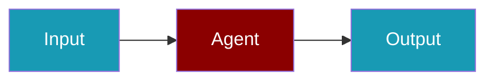

# Google Vertex AI CLI Commands

## Environment Setup

```bash
export GOOGLE_APPLICATION_CREDENTIALS=/path/to/service-account.json
export GOOGLE_CLOUD_PROJECT=your-project-id
```

## Commands

```bash
praisonai-ts providers doctor google-vertex
praisonai-ts providers test google-vertex gemini-1.5-pro
praisonai-ts providers doctor google-vertex --json
```

## Aliases

```bash
praisonai-ts providers doctor vertex
```

## Related

<CardGroup cols={2}>
  <Card title="Google Vertex AI Code Usage" icon="book" href="/docs/js/providers/google-vertex-code">
    Google Vertex AI Code Usage
  </Card>
</CardGroup>