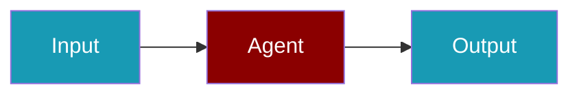

# Groq Provider

Ultra-fast inference with Groq's LPU technology.

## Environment Variables

```bash
export GROQ_API_KEY=gsk_...
```

## Supported Modalities

| Modality | Supported |
|----------|-----------|
| Text/Chat | ✅ |
| Tools | ✅ |

## Quick Start

<Steps>
<Step title="Simple Usage">
```typescript
import { Agent } from 'praisonai';

const agent = new Agent({
  name: 'GroqAgent',
  instructions: 'You are a helpful assistant.',
  llm: 'groq/llama-3.3-70b-versatile'
});

const response = await agent.chat('Hello!');
```
</Step>
<Step title="With Configuration">
Adjust provider credentials and model settings for production — see the sections above.
</Step>
</Steps>

## Available Models

| Model | Description |
|-------|-------------|
| `llama-3.3-70b-versatile` | Llama 3.3 70B |
| `mixtral-8x7b-32768` | Mixtral 8x7B |
| `gemma2-9b-it` | Gemma 2 9B |

## Related

<CardGroup cols={2}>
  <Card title="Groq CLI Usage" icon="terminal" href="/docs/js/providers/groq-cli">
    Groq CLI Usage
  </Card>
</CardGroup>