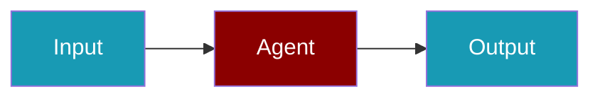

# Hugging Face CLI Commands

## Environment Setup

```bash
export HUGGINGFACE_API_KEY=hf_...
```

## Commands

```bash
praisonai-ts providers doctor huggingface
praisonai-ts providers test huggingface meta-llama/Llama-2-70b-chat-hf
praisonai-ts providers doctor huggingface --json
```

## Related

<CardGroup cols={2}>
  <Card title="Hugging Face Code Usage" icon="book" href="/docs/js/providers/huggingface-code">
    Hugging Face Code Usage
  </Card>
</CardGroup>
