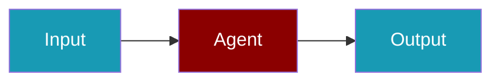

# LangDB CLI Commands

## Environment Setup

```bash
export LANGDB_API_KEY=...
```

## Commands

```bash
praisonai-ts providers doctor langdb
praisonai-ts providers doctor langdb --json
```

## Related

<CardGroup cols={2}>
  <Card title="LangDB Code Usage" icon="book" href="/docs/js/providers/langdb-code">
    LangDB Code Usage
  </Card>
</CardGroup>
