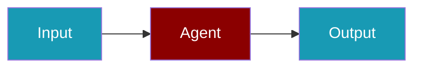

# Letta CLI Commands

## Environment Setup

```bash
export LETTA_API_KEY=...
```

## Commands

```bash
praisonai-ts providers doctor letta
praisonai-ts providers doctor letta --json
```

## Related

<CardGroup cols={2}>
  <Card title="Letta Code Usage" icon="book" href="/docs/js/providers/letta-code">
    Letta Code Usage
  </Card>
</CardGroup>
