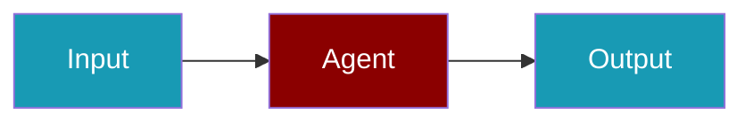

# Mem0 CLI Commands

## Environment Setup

```bash
export MEM0_API_KEY=...
```

## Commands

```bash
praisonai-ts providers doctor mem0
praisonai-ts providers doctor mem0 --json
```

## Related

<CardGroup cols={2}>
  <Card title="Mem0 Code Usage" icon="book" href="/docs/js/providers/mem0-code">
    Mem0 Code Usage
  </Card>
</CardGroup>
