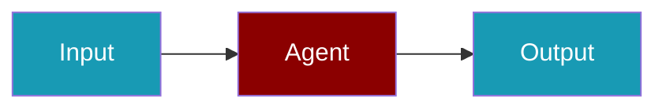

# MiniMax CLI Commands

## Environment Setup

```bash
export MINIMAX_API_KEY=...
```

## Commands

```bash
praisonai-ts providers doctor minimax
praisonai-ts providers doctor minimax --json
```

## Related

<CardGroup cols={2}>
  <Card title="MiniMax Code Usage" icon="book" href="/docs/js/providers/minimax-code">
    MiniMax Code Usage
  </Card>
</CardGroup>
