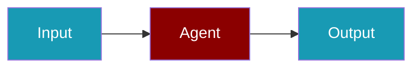

# Ollama CLI Commands

## Environment Setup

```bash
export OLLAMA_BASE_URL=http://localhost:11434
```

## Commands

```bash
praisonai-ts providers doctor ollama
praisonai-ts providers test ollama llama3.2
praisonai-ts providers doctor ollama --json
```

## Aliases

```bash
praisonai-ts providers doctor local
```

## Related

<CardGroup cols={2}>
  <Card title="Ollama Code Usage" icon="book" href="/docs/js/providers/ollama-code">
    Ollama Code Usage
  </Card>
</CardGroup>
