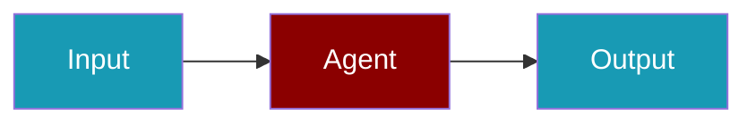

# Perplexity CLI Commands

## Environment Setup

```bash
export PERPLEXITY_API_KEY=...
```

## Commands

```bash
praisonai-ts providers doctor perplexity
praisonai-ts providers test perplexity llama-3.1-sonar-large-128k-online
praisonai-ts providers doctor perplexity --json
```

## Aliases

```bash
praisonai-ts providers doctor pplx
```

## Related

<CardGroup cols={2}>
  <Card title="Perplexity Code Usage" icon="book" href="/docs/js/providers/perplexity-code">
    Perplexity Code Usage
  </Card>
</CardGroup>
