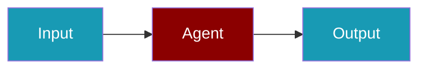

# Perplexity Provider

Search-augmented AI with Perplexity.

## Environment Variables

```bash
export PERPLEXITY_API_KEY=...
```

## Quick Start

<Steps>
<Step title="Simple Usage">
```typescript
import { Agent } from 'praisonai';

const agent = new Agent({
  name: 'PerplexityAgent',
  instructions: 'You are a helpful assistant.',
  llm: 'perplexity/llama-3.1-sonar-large-128k-online'
});

const response = await agent.chat('What is the latest news?');
```
</Step>
<Step title="With Configuration">
Adjust provider credentials and model settings for production — see the sections above.
</Step>
</Steps>

## Related

<CardGroup cols={2}>
  <Card title="Perplexity CLI Usage" icon="terminal" href="/docs/js/providers/perplexity-cli">
    Perplexity CLI Usage
  </Card>
</CardGroup>
