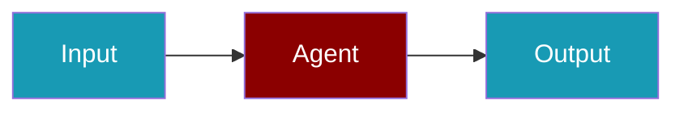

# Qwen CLI Commands

## Environment Setup

```bash
export DASHSCOPE_API_KEY=...
```

## Commands

```bash
praisonai-ts providers doctor qwen
praisonai-ts providers doctor qwen --json
```

## Aliases

```bash
praisonai-ts providers doctor alibaba
praisonai-ts providers doctor dashscope
```

## Related

<CardGroup cols={2}>
  <Card title="Qwen Code Usage" icon="book" href="/docs/js/providers/qwen-code">
    Qwen Code Usage
  </Card>
</CardGroup>
