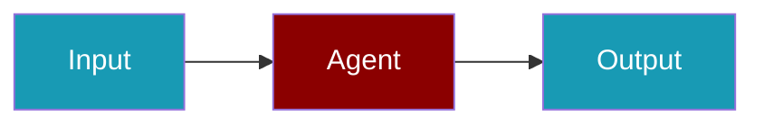

# Replicate CLI Commands

## Environment Setup

```bash
export REPLICATE_API_TOKEN=...
```

## Commands

```bash
praisonai-ts providers doctor replicate
praisonai-ts providers test replicate meta/llama-2-70b-chat
praisonai-ts providers doctor replicate --json
```

## Related

<CardGroup cols={2}>
  <Card title="Replicate Code Usage" icon="book" href="/docs/js/providers/replicate-code">
    Replicate Code Usage
  </Card>
</CardGroup>
