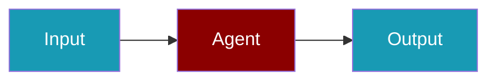

# Rev.ai CLI Commands

## Environment Setup

```bash
export REVAI_API_KEY=...
```

## Commands

```bash
praisonai-ts providers doctor revai
praisonai-ts providers doctor revai --json
```

## Related

<CardGroup cols={2}>
  <Card title="Rev.ai Code Usage" icon="book" href="/docs/js/providers/revai-code">
    Rev.ai Code Usage
  </Card>
</CardGroup>
