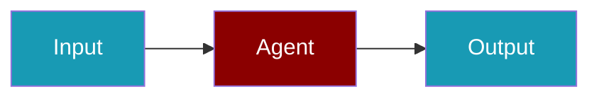

# Together.ai CLI Commands

## Environment Setup

```bash
export TOGETHER_API_KEY=...
```

## Commands

```bash
praisonai-ts providers doctor togetherai
praisonai-ts providers test togetherai meta-llama/Llama-3-70b-chat-hf
praisonai-ts providers doctor togetherai --json
```

## Aliases

```bash
praisonai-ts providers doctor together
```

## Related

<CardGroup cols={2}>
  <Card title="Together.ai Code Usage" icon="book" href="/docs/js/providers/togetherai-code">
    Together.ai Code Usage
  </Card>
</CardGroup>
